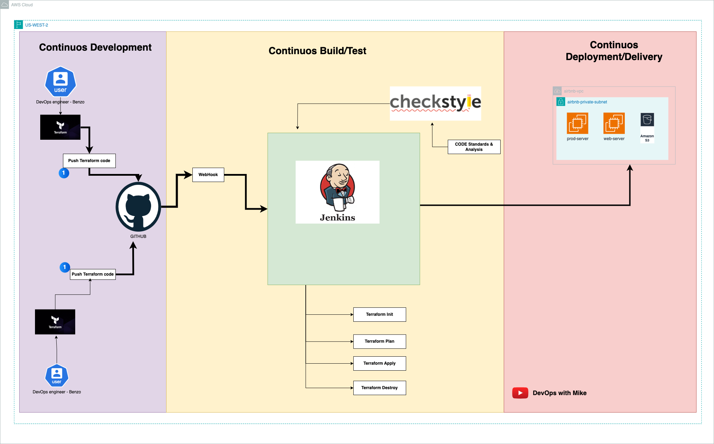

# Jenkins-Terraform-Infra-repo

This repo is maintained by [Devops with Mike](https://www.youtube.com/@DevOpsWithMike0/videos/)

For Cloud and DevOps interview preparation, use this platform [Wandaprep](http://www.wandaprep.com/)

# Jenkins Pipelines
Jenkins Pipeline (or simply "Pipeline" with a capital "P") is a suite of plugins which supports implementing and integrating continuous delivery pipelines into Jenkins.
- A continuous delivery (CD) pipeline is an automated expression of your process for getting software from version control right through to your users and customers. 
- Every change to your software (committed in source control) goes through a complex process on its way to being released. 
- This process involves building the software in a reliable and repeatable manner, as well as progressing the built software (called a "build") through multiple stages of testing and deployment.
- The definition of a Jenkins Pipeline is written into a text file (called a `Jenkinsfile`) which in turn can be committed to a project’s source control repository

The flowchart below is an example of one CD scenario easily modeled in Jenkins Pipeline


## Pipeline syntax overview
In Declarative Pipeline syntax, the pipeline block defines all the work done throughout your entire Pipeline.

```sh

pipeline {
    agent any
    stages {
        stage('Build') {
            steps {
                //
            }
        }
        stage('Test') {
            steps {
                //
            }
        }
        stage('Deploy') {
            steps {
                //
            }
        }
    }
}

```
---

- Execute this Pipeline or any of its stages, on any available agent.
- Defines the "`Build`" stage.
- Perform some steps related to the "`Build`" stage.
- Defines the "`Test`" stage.
- Perform some steps related to the "`Test`" stage.
- Defines the "`Deploy`" stage.
- Perform some steps related to the "`Deploy`" stage.

### Using a Jenkinsfile

To know more how to use Jenkinsfile, use this documentation on Jenkinsfile. https://www.jenkins.io/doc/book/pipeline/jenkinsfile/

# Configuration setup for (wandaprep-tf-infra-pipeline) using Terraform, Slack and Jenkins CI

Fully automated and secured Terraform infra pipeline



## CICD Infra setup
1) ###### GitHub setup
    Fork GitHub Repository by using the existing repo "jenkins-terraform-infra-repo" (https://github.com/devopsmike-01/jenkins-terraform-infra-repo.git)     
    - Go to GitHub (github.com)
    - Login to your GitHub Account
    - Fork repository "jenkins-terraform-infra-repo" (https://github.com/devopsmike-01/jenkins-terraform-infra-repo.git) & name it "wandaprep-tf-infra-repo.git"
    - Clone your newly created repo to your local

2) ###### Jenkins
    - Create an **Amazon Linux 2023 VM** instance and call it "Jenkins"
    - Instance type: t2.medium
    - Security Group (Open): 8080 and 22 to 0.0.0.0/0
    - Key pair: Select or create a new keypair
    - **Attach Jenkins server with IAM role having "AdministratorAccess"**
    - Launch Instance
    - After launching this Jenkins server, attach a tag as **Key=Application, value=jenkins**
    - SSH into the instance and Run the following commands in the **jenkins.sh** file found in the **installation-files** directory

3) ###### Slack 
    - **Join the slack channel** https://join.slack.com/t/devopswithmike/shared_invite/zt-1q6h1yw0j-d3Rt7Bu6rEkPHVBC5y82nw 
    - **Join into the channel** `#wandaprep-infra-team` or join with this link https://devopswithmike.slack.com/archives/C082HEGTCJJ

### Jenkins setup
1) #### Access Jenkins
    Copy your Jenkins Public IP Address and paste on the browser = **ExternalIP:8080** Example (**http://37.8.93.202:8080**)
    - Login to your Jenkins instance using your Shell (GitBash or your Mac Terminal)
    - Copy the Path from the Jenkins UI to get the Administrator Password
        - Run: `sudo cat /var/lib/jenkins/secrets/initialAdminPassword`
        - Copy the password and login to Jenkins
    - Plugins: Choose Install Suggested Plugings 
    - Provide 
        - Username: **admin**
        - Password: **admin**
        - Name and Email can also be admin. You can use `admin` all, as its a poc.
    - Continue and Start using Jenkins

2)  #### Pipeline creation
    - Click on **New Item**
    - Enter an item name: **wandaprep-tf-infra-pipeline** & select the category as **Pipeline**
    - Now scroll-down and in the Pipeline section --> Definition --> Select Pipeline script from SCM
    - SCM: **Git**
    - Repositories
        - Repository URL: FILL YOUR OWN REPO URL (that we created by importing in the first step)
        - Branch Specifier (blank for 'any'): */main
        - Script Path: Jenkinsfile
    - Save

3)  #### Terraform Plugin installations:
    - Click on "Manage Jenkins"
    - Click on "Plugin Manager"
    - Click "Available"
    - Search and Install the following Plugings "Install Without Restart"        
        - **Terraform**

4)  #### Teraform Plugin Setup installations:
    - Click on "Manage Jenkins"
    - Click on "Tools"
    - Search for "Terraform" and add "Terraform". Use the "41023 linux amd64" version of Terraform
    - Save


5)  #### Credentials setup(AWS):
    - Click on Manage Jenkins --> Manage Credentials --> Global credentials (unrestricted) --> Add Credentials
        1)  ###### AWS Credential (AWS_ACCESS_KEY)
            - Kind: Secret text            
            - Secret: `lXpiMy7yGJLm9V6OsMmdkKVS` // Replace this with the ACCESS-KEY of your IAM User
            - ID: jenkins-aws-secret-key-id
            - Description: jenkins-aws-secret-key-id
            - Click on Create    
        2) ###### AWS Credential (AWS_SECRET_ACCESS_KEY) 
            - Kind: Secret text            
            - Secret: `lXpiMy7yGJLm9V6OsMmdkKVS` // Replace this with the SECRET-ACCESS-KEY of your IAM User
            - ID: jenkins-aws-secret-access-key
            - Description: jenkins-aws-secret-access-key
            - Click on Create              
6)  #### Credentials setup(Slack):
    - Click on Manage Jenkins --> Manage Credentials --> Global credentials (unrestricted) --> Add Credentials
        1)  ###### Slack secret token (slack-token)
            - Kind: Secret text            
            - Secret: `lXpiMy7yGJLm9V6OsMmdkKVS`
            - ID: Slack-token
            - Description: Slack-token
            - Click on Create                

        2)  #### Configure system:
            - Click on Manage Jenkins --> Configure System

            1)  - Go to section Slack
                - Workspace: **devopswithmike** (if not working try with Team-subdomain `devopswithmike`)
                - Credentials: select the slack-token credentials (created above) from the drop-down   

### Performing continous integration with GitHub webhook

1) #### Add jenkins webhook to github
    - Access your repo **wandaprep-tf-infra-repo** on github
    - Goto Settings --> Webhooks --> Click on Add webhook 
    - Payload URL: **htpp://REPLACE-JENKINS-SERVER-PUBLIC-IP:8080/github-webhook/**    (Note: The IP should be public as GitHub is outside of the AWS VPC where Jenkins server is hosted)
    - Click on Add webhook

2) #### Configure on the Jenkins side to pull based on the event
    - Access your jenkins server, pipeline **wandaprep-tf-infra-pipeline**
    - Once pipeline is accessed --> Click on Configure --> In the General section --> **Select GitHub project checkbox** and fill your repo URL of the project.
    - Scroll down --> In the Build Triggers section -->  **Select GitHub hook trigger for GITScm polling checkbox**

Once both the above steps are done click on Save.


### Codebase setup

1) #### For checking the Gitbut webhook uncomment lines 18-24 in main.tf file
    - Go back to your local, open your "wandaprep-tf-infra-repo" project on VSCODE
    - Open "main.tf file" uncomment lines   
    - Save the changes in both files
    - Finally push changes to repo
        `git add .`
        `git commit -m "relevant commit message"`
        `git push`
### Finally observe the whole flow and understand the integrations

# Happy learning